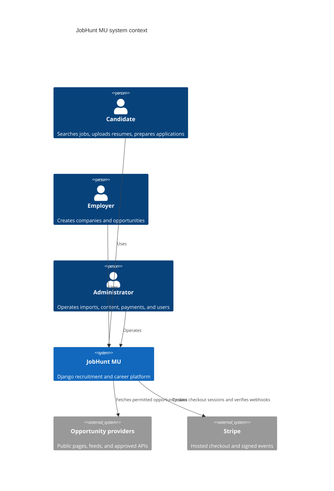
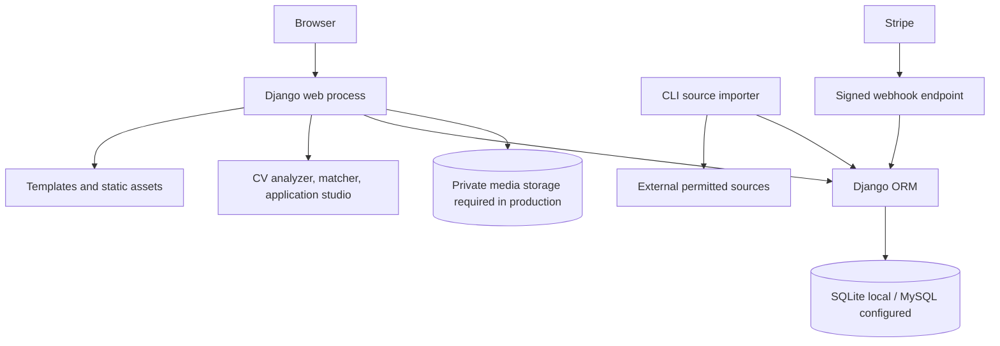
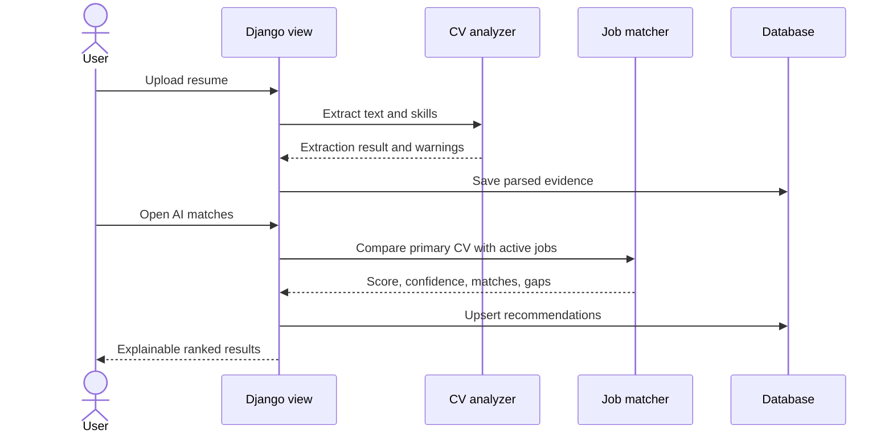

# Architecture

## System context

## Containers

## Main modules

- `myapp/models.py`: persistent domain model.
- `myapp/views.py`: server-rendered request orchestration and access control.
- `myapp/services/cv_analyzer.py`: PDF/DOCX extraction and candidate evidence detection.
- `myapp/services/job_matcher.py`: deterministic, explainable compatibility scoring.
- `myapp/services/application_studio.py`: grounded draft generation.
- `scrape_jobs.py`: normalized multi-source ingestion.
- `scrape_myjobmu.py`: MyJob-specific collection support.
- `myapp/management/commands/archive_stale_jobs.py`: lifecycle maintenance.

## Recommendation flow

## Architectural decisions

1. **Django monolith:** appropriate for an early-stage product because authentication, ORM, templates, admin, and payments remain cohesive.
2. **Service modules:** matching and document logic are separated from views so they can later become APIs or workers.
3. **Explainability first:** deterministic evidence is preferred over an opaque hiring prediction.
4. **CLI ingestion:** importers run independently from web requests and can later move to Celery/Redis.
5. **Hosted payment UI:** Stripe Checkout reduces payment-card handling scope.

## Known architectural gaps

- Production-grade private object storage is not implemented.
- Long-running imports are not yet queued through a worker system.
- No public versioned REST API exists.
- Database support is optimized for local SQLite and configurable MySQL; production PostgreSQL support is planned.
- The Django app is broad and should eventually be split into `accounts`, `opportunities`, `resumes`, `matching`, `applications`, `billing`, and `ingestion` apps.
