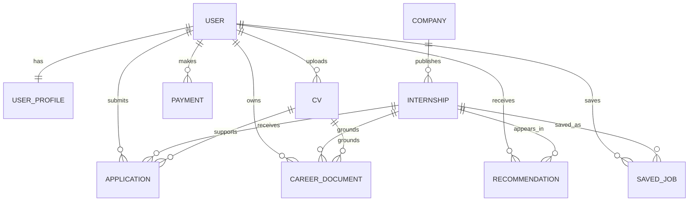

# Database schema

## Key entities

- **UserProfile:** role, profile details, structured skills/education/experience, Premium flag.
- **CV:** private uploaded file, extracted text, detected skills, parsing warnings, primary indicator.
- **Company:** employer identity and public metadata.
- **Internship:** legacy model name representing all opportunity types, including jobs and freelance roles.
- **Recommendation:** explainable score, evidence, confidence, and candidate action state.
- **Application:** candidate submission and lifecycle status.
- **CareerDocument:** generated resume, cover-letter, or application-email draft.
- **ImportRun:** source ingestion status and counts.
- **Payment:** checkout and premium payment records.

## Important constraints

- External opportunity IDs and source URLs prevent common duplicates.
- One saved-job row is allowed per user/opportunity.
- One recommendation row is allowed per user/opportunity.
- One application is allowed per user/opportunity.
- Resume ownership must be enforced in every view.

## Naming debt

`Internship` now represents several opportunity types. A future migration should rename it to `Opportunity` while preserving backward compatibility.
