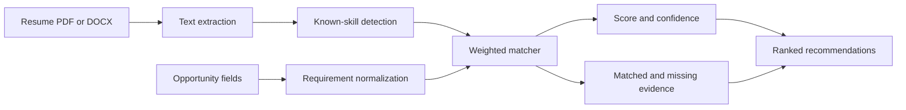
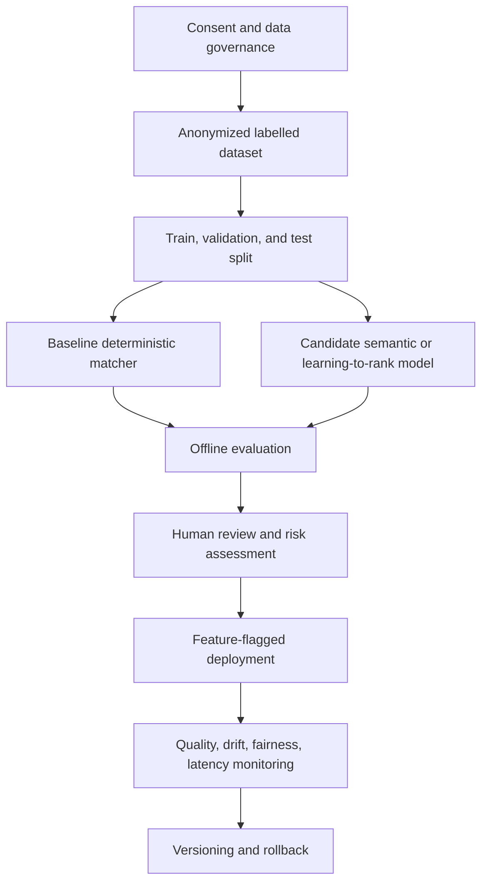

# AI and machine-learning workflow

## Current implementation

JobHunt MU does not currently train or ship a proprietary machine-learning model. The matching layer is a deterministic, explainable system using extracted text, normalized skills, aliases, title evidence, and weighted scoring. This choice supports auditability while the product lacks a consented labelled dataset.

## Current pipeline

## Future ML lifecycle

## Required artifacts before a trained model

- data sheet describing provenance, consent, retention, and exclusions;
- model card describing purpose, metrics, limitations, and prohibited uses;
- reproducible training configuration and fixed evaluation set;
- feature and label definitions;
- fairness and subgroup evaluation plan;
- threshold and rollback policy;
- human-review requirements;
- evidence that generated documents do not fabricate facts.

## Appropriate metrics

Use skill extraction precision/recall/F1, ranking precision@k, nDCG, human agreement, calibration where probabilities exist, latency, and unsupported-claim rate. Do not use application success alone as a clean ground-truth label because hiring outcomes contain confounding factors and historical bias.
