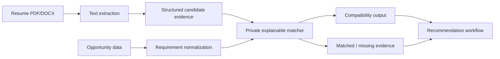

# Recommendation and Resume-Analysis Architecture

## Current public scope

JobHunt MU does not claim to ship a trained proprietary machine-learning model in this showcase.

The full private project includes an explainable recommendation workflow that compares candidate-provided evidence with structured opportunity data. Exact normalization rules, aliases, weights, thresholds, ranking behavior and tuning are intentionally excluded from the public repository.

The public project retains document-processing and architectural evidence without presenting a compatibility score as a prediction of hiring success.

## Why the matcher is private

Recommendation quality depends on product-specific normalization, weighting, confidence and ranking decisions. Publishing those details would make the highest-value behavior of the project straightforward to reproduce, while adding little recruiter evidence beyond the architecture and service contract.

The public repository therefore demonstrates:

- document extraction and resume-analysis engineering;
- Django service boundaries;
- relational models for recommendations and evidence;
- candidate-facing recommendation/application workflows;
- testing and security considerations.

The complete scoring implementation remains private.

## Future ML evaluation

If a learned ranking or semantic model is introduced, it should be evaluated with consented and appropriately governed data. Useful artifacts would include dataset provenance, feature/label definitions, reproducible train/validation/test splits, model cards, fairness review, rollback policy and human-review requirements.

Relevant metrics can include extraction precision/recall/F1, ranking precision@k, nDCG, human agreement, latency and unsupported-claim rate. Application success alone should not be treated as clean ground truth because hiring outcomes contain substantial confounding factors.
