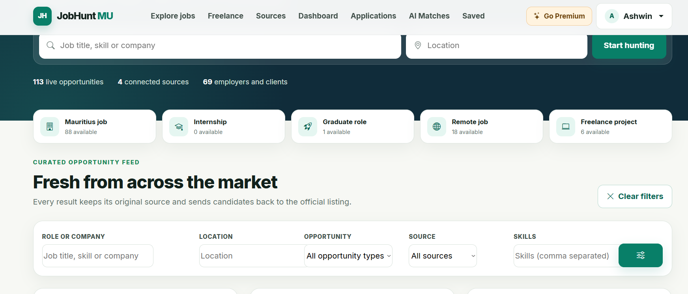
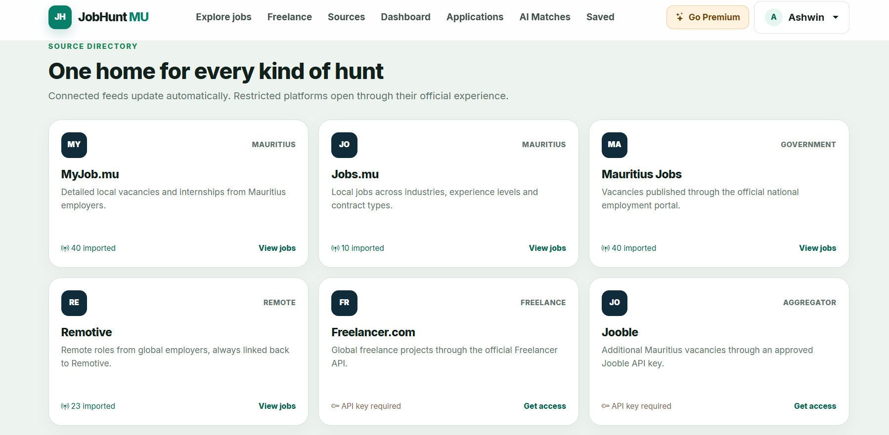
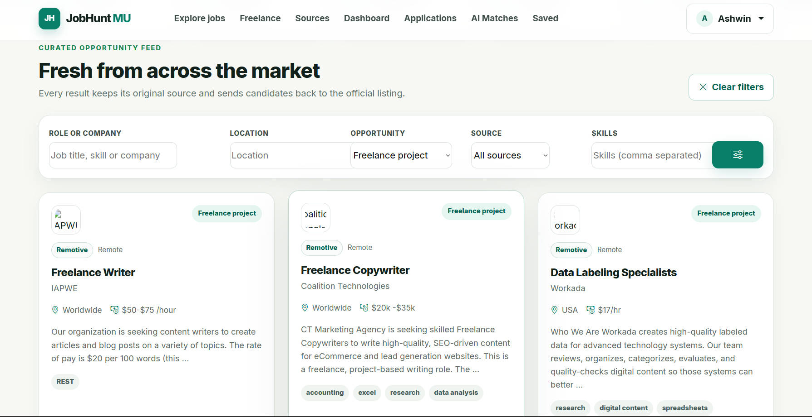
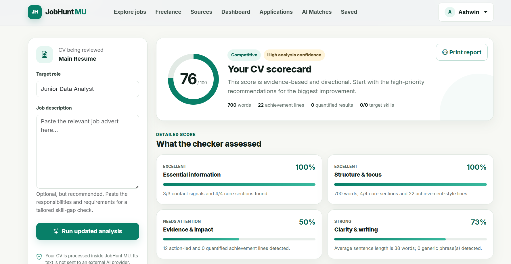
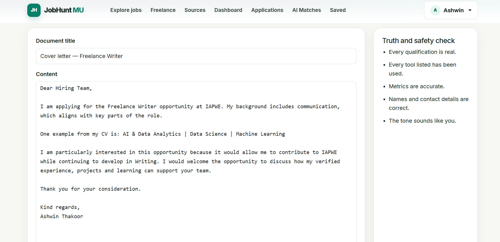
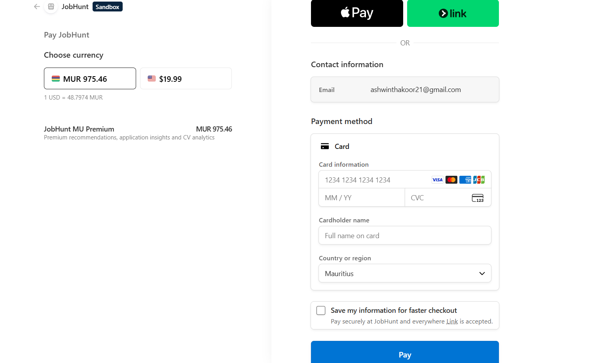
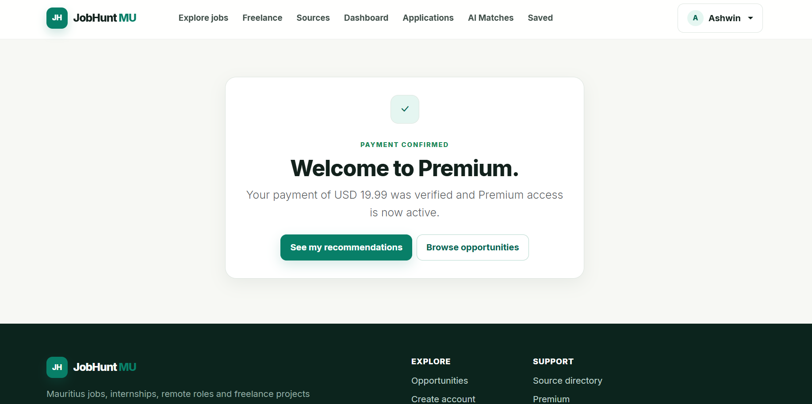
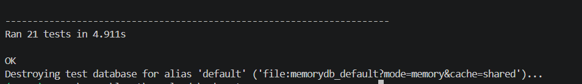
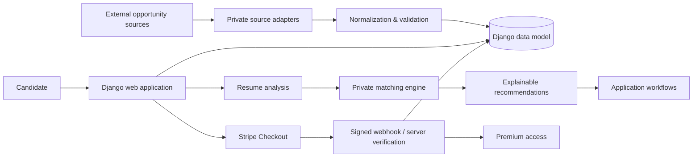

# JobHunt MU

### AI-Assisted Recruitment Platform | Python • Django • SQLite • Stripe • Data Processing

**Recruiter-facing engineering showcase for an independently built job-discovery and application platform.**

> **Demo / active development:** JobHunt MU is a working portfolio demo, not a finished commercial recruitment service. The screenshots and figures below document functionality verified in the private development build on **17 August 2026**. Matching, AI-facing workflows, UI polish and product depth are still being improved.

JobHunt MU brings multi-source opportunity data into a normalized Django application and combines discovery with candidate workflows, resume analysis, explainable matching, application preparation, payments and automated testing.

> **Public-repository boundary:** this repository is a curated technical showcase, not the complete private JobHunt MU product. Source-specific collection adapters, exact recommendation weights/rules, private generation logic, credentials, user data, live datasets and commercially useful implementation details are intentionally excluded.

## At a glance

| Verified demo metric | Result |
|---|---:|
| Opportunities | **113** |
| Connected sources | **4** |
| Employers / clients | **69** |
| Automated tests | **21/21 passing** |
| Payments | **Stripe Sandbox verified** |
| Premium activation | **Server-side verified** |

The numbers above are a **point-in-time development snapshot**, not a promise of continuously live production inventory.

## Working demo

### Multi-source opportunity discovery



The verified build aggregated **113 opportunities across 4 connected sources** and displayed **69 employers/clients**, with filtering by role/company, location, opportunity type, source and skills.

### Source directory



The verified snapshot contained imported opportunities from **MyJob.mu, Jobs.mu, Mauritius Jobs and Remotive**. Optional providers requiring credentials are not counted as connected sources.

### Freelance discovery



Freelance projects live in the same normalized discovery experience while retaining source attribution, location, compensation information and extracted skill context.

### CV analysis



The CV workflow provides evidence-oriented scoring, structured checks and prioritized recommendations. Scores are directional and are **not presented as predictions of hiring outcomes or guaranteed ATS performance**.

### Application Studio



The private demo includes editable application-document workflows with explicit truth/safety reminders. Candidates are prompted to verify qualifications, tools, metrics, contact details and tone before using generated material.

### Stripe Sandbox payment flow

<table>
<tr>
<td width="50%"></td>
<td width="50%"></td>
</tr>
<tr>
<td align="center"><b>Stripe-hosted Sandbox Checkout</b></td>
<td align="center"><b>Verified payment → Premium activation</b></td>
</tr>
</table>

The application does not grant Premium merely because the browser reaches a success URL. Payment state is checked server-side, with Stripe webhook events participating in the verification flow.

### Automated regression testing



**21/21 automated tests passed** in the verified private build, and Django's system check reported no issues.

## Verified capabilities

| Capability | Verified private demo evidence |
|---|---|
| Opportunity aggregation | **113 opportunities** displayed across **4 connected sources** |
| Connected sources | MyJob.mu, Jobs.mu, Mauritius Jobs, Remotive |
| Employers / clients | **69** displayed in the verified build |
| Discovery | Search/filtering across jobs, remote roles, graduate roles and freelance projects |
| Candidate workflows | Saved opportunities and application tracking |
| Resume intelligence | PDF/DOCX analysis, evidence-oriented scoring and skill-gap workflows |
| Recommendations | Explainable candidate/job matching with matched and missing skill evidence |
| Application Studio | Cover-letter / application-email workflows with premium document generation |
| Payments | Stripe-hosted Checkout tested successfully in **Sandbox** mode |
| Payment verification | Successful test payment, server-side verification and Premium activation |
| Webhooks | `payment_intent.succeeded` and `checkout.session.completed` delivered to Django with HTTP `200` during the verified test |
| Automated tests | **21/21 passing** in the private build; Django system check reported no issues |

## Product flow

1. Aggregate and normalize opportunities from multiple connected sources.
2. Browse a unified market feed with original-source attribution and filters.
3. Discover freelance and remote opportunities alongside conventional jobs.
4. Save opportunities and manage candidate workflows.
5. Analyze a CV and produce structured, explainable feedback.
6. Rank opportunities using interpretable matching evidence.
7. Prepare application material with truth/safety review prompts.
8. Upgrade through Stripe-hosted Checkout.
9. Verify payment server-side before granting Premium access.

## Technology

| Area | Technologies / concepts |
|---|---|
| Backend | Python, Django |
| Data | SQLite, relational modeling, normalization, ingestion workflows |
| Documents | PDF/DOCX extraction, structured resume analysis, DOCX generation |
| Recommendations | Explainable matching architecture and evidence-based output |
| Payments | Stripe Checkout, signed webhooks, server-side payment verification |
| Frontend | Django templates, Bootstrap, custom CSS |
| Engineering | Git, Docker, GitHub Actions, automated tests, Ruff, CodeQL |

## Architecture



The public repository retains enough structure to demonstrate Django application design, models, views, templates, document-processing concepts, configuration, testing and engineering documentation. Parts that would allow straightforward reproduction of the private product's highest-value behavior are deliberately abstracted.

## Testing & reliability

The **private development build passed 21/21 automated tests** during the 17 August 2026 verification run. Coverage includes:

- public job-board rendering, category/source filtering and visibility rules;
- premium/basic recommendation access control and ranked/explainable recommendations;
- recommendation saving, skill-alias normalization and matching confidence;
- CV scoring, skill-gap analysis and user isolation;
- Application Studio basic/premium permissions and premium DOCX generation/editing;
- scraper description parsing;
- Stripe Checkout creation;
- prevention of Premium activation from an unverified/legacy success path;
- successful paid-checkout Premium activation;
- prevention of Premium activation for unpaid Checkout sessions.

The public repository contains a sanitized recruiter-visible test suite and CI configuration. Some private tests and implementation details remain excluded with the private product.

## Payment verification

Stripe is implemented as a server-verified workflow rather than trusting a browser redirect.

```text
Stripe Checkout created
        ↓
Sandbox payment succeeds
        ↓
payment_intent.succeeded → Django webhook → HTTP 200
checkout.session.completed → Django webhook → HTTP 200
        ↓
Server verifies payment state
        ↓
Premium access activated
```

No real card or production credentials are required for this portfolio demonstration. Stripe secrets, webhook signing secrets and `.env` files are never committed.

## Data ingestion

During the verified demo snapshot, the UI displayed:

- **MyJob.mu** — 40 imported opportunities
- **Jobs.mu** — 10 imported opportunities
- **Mauritius Jobs** — 40 imported opportunities
- **Remotive** — 23 imported opportunities

Total: **113 opportunities across four connected sources** in the verified local build.

For IP protection, source-specific adapters are excluded from this public showcase. The architecture follows a connector → normalization → validation/deduplication → persistence → freshness-tracking pipeline.

## Public vs private boundary

| Included in this showcase | Kept private |
|---|---|
| Django project/application structure | Source-specific scraping/collection implementations |
| Selected domain models and workflows | Exact recommendation weights, aliases, heuristics and tuning |
| Resume-analysis engineering examples | Private application-generation rules |
| Templates and UI structure | Production endpoints and adapter details that materially simplify cloning |
| Payment-integration architecture | Production credentials and deployment secrets |
| Safe environment-variable examples | User resumes and generated private documents |
| Docker, CI and testing configuration | Full/live scraped datasets |
| Architecture/security/development docs | Internal product research and commercially useful implementation details |

## Project structure

```text
jobhunt-mu/
├── myapp/                 # Django application
│   ├── services/          # Public service boundaries / selected safe implementation
│   ├── templates/         # Candidate workflows
│   ├── static/            # UI assets
│   └── migrations/        # Data-model evolution
├── myproject/             # Django configuration
├── data/                  # Sanitized samples/documentation only
├── docs/
│   └── screenshots/       # Verified portfolio-demo evidence
├── .github/               # CI and security automation
├── Dockerfile
├── docker-compose.yml
└── README.md
```

## Security & privacy

The project treats resumes and application documents as personal information. `.env` files, database files, uploaded resumes, generated private documents, production secrets and full live datasets should never be committed to a public repository.

The included `.env.example` contains placeholders only. Local development defaults to SQLite, while database and Stripe configuration are environment-driven.

## Project status & roadmap

**Current status: working portfolio demo / active development.**

This repository demonstrates that the core engineering workflows function while keeping the complete private product and commercially sensitive implementation details protected.

Current improvement areas include stronger role-relevance ranking, refinement of AI-facing CV/matching experiences, richer dashboard/application workflows, broader approved data-provider integrations, continued UI/UX refinement and production hardening.

The current build should therefore be read as a **verified engineering milestone**, not the final JobHunt MU product.

## Recruiter review path

For a quick technical review:

1. `docs/screenshots/` — working product evidence.
2. `myapp/tests.py` — regression evidence for job-board, CV-analysis and payment behavior.
3. `myapp/services/cv_analyzer.py` — resume/document analysis engineering.
4. `myapp/models.py` — relational/domain modeling.
5. `myapp/views.py` — Django workflow and payment integration patterns.
6. `ARCHITECTURE.md` — system boundaries and data flow.
7. `.github/workflows/` — CI and CodeQL automation.
8. `SECURITY.md` — privacy/security considerations.

## Author

**Ashwin Thakoor**  
AI, Data & Backend Development  
Mauritius — open to international relocation and remote opportunities

## Usage and IP

The public repository is provided for portfolio review and technical discussion. Third-party job content, logos, trademarks and datasets remain subject to their respective owners' terms. The complete JobHunt MU implementation and excluded private components are not granted by publication of this showcase.
