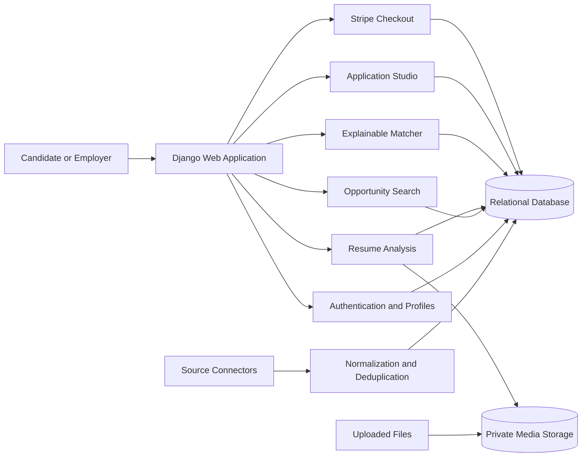
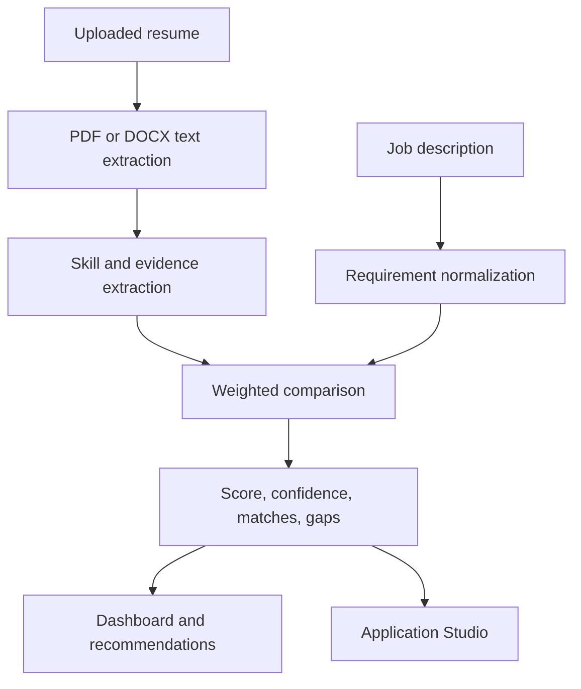
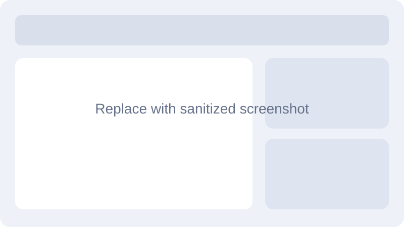

<div align="center">


# JobHunt MU

**An explainable, AI-assisted recruitment platform for job discovery, resume analysis, application preparation, and opportunity aggregation.**

[](.github/workflows/ci.yml)
[](https://www.python.org/)
[](https://www.djangoproject.com/)
[](LICENSE)
[](https://docs.astral.sh/ruff/)
[](SECURITY.md)

[Quick start](#quick-start) · [Architecture](ARCHITECTURE.md) · [Documentation](docs/README.md) · [Roadmap](ROADMAP.md) · [Contributing](CONTRIBUTING.md)

</div>

## Overview

JobHunt MU is a Django-based career platform that aggregates opportunities from multiple permitted sources and helps candidates understand how their resume aligns with a role. The repository demonstrates full-stack product engineering, explainable matching, document parsing, payment integration, background data-ingestion workflows, and production-oriented engineering practices.

> **Project status:** portfolio-grade private-beta software. It is not represented as a production replacement for established recruitment networks, and its matching score does not predict hiring outcomes.

## Problem statement

Job seekers often search across fragmented websites, repeatedly rewrite application documents, and receive little explanation about why a role may or may not fit their profile. Recruiters and job platforms also need better data quality, freshness tracking, and transparent recommendation logic.

## Solution

JobHunt MU combines:

- multi-source opportunity ingestion with deduplication and freshness metadata;
- secure PDF/DOCX resume upload and text extraction;
- explainable candidate-to-job matching;
- saved jobs and application tracking;
- premium application preparation workflows;
- Stripe-hosted checkout and signed webhook handling;
- Django administration for jobs, companies, users, imports, and generated documents.

## Core features

| Area | Capability |
|---|---|
| Opportunity discovery | Search, category, source, location, skill, and work-mode filters |
| Data ingestion | MyJob.mu, Jobs.mu, Mauritius Jobs, Remotive, and optional approved API connectors |
| Resume intelligence | PDF/DOCX extraction, detected skills, warnings, primary-resume selection |
| Explainable matching | Match score, matched skills, missing skills, score breakdown, confidence |
| Application studio | Tailored resume draft, cover letter, application email, editable DOCX export |
| Candidate workflow | Saved jobs, recommendation actions, application history, dashboard |
| Monetization | Basic/Premium access controls, Stripe Checkout, webhook verification |
| Operations | Import-run history, stale-job archiving, Django Admin, automated tests |

## Technology stack

- **Backend:** Python 3.12/3.13, Django 5.1
- **Frontend:** Django templates, Bootstrap 5, custom CSS, Bootstrap Icons
- **Data:** SQLite for local development; MySQL supported through environment configuration
- **Document processing:** pypdf, python-docx, Pillow
- **Data engineering:** requests, Beautiful Soup, pandas, openpyxl
- **Payments:** Stripe Checkout and signed webhooks
- **Quality:** Django TestCase, Ruff, pre-commit, GitHub Actions
- **Deployment:** Docker, Gunicorn, WhiteNoise-compatible static collection guidance

## Architecture overview



See [ARCHITECTURE.md](ARCHITECTURE.md) for boundaries, data flows, trade-offs, and design decisions.

## AI and matching architecture

The current recommendation engine is **explainable rules and weighted matching**, not a proprietary trained foundation model. It extracts known skills from resume text, normalizes aliases, compares them with job requirements and titles, and returns a score with evidence. Application-document generation is template-assisted and grounded in resume/job content.



The current and future lifecycle is documented in [MACHINE_LEARNING.md](MACHINE_LEARNING.md); limitations and evaluation requirements are in [PERFORMANCE.md](PERFORMANCE.md).

## Quick start

### 1. Clone and create an environment

```bash
git clone https://github.com/AshwinThakoor/jobhunt-mu.git
cd jobhunt-mu
python -m venv .venv
```

Windows PowerShell:

```powershell
.\.venv\Scripts\Activate.ps1
```

macOS/Linux:

```bash
source .venv/bin/activate
```

### 2. Install dependencies

```bash
python -m pip install --upgrade pip
python -m pip install -r requirements.txt
```

### 3. Configure the application

```bash
cp .env.example .env
```

Generate a local secret:

```bash
python -c "from django.core.management.utils import get_random_secret_key; print(get_random_secret_key())"
```

Place it in `.env`, then review [CONFIGURATION.md](CONFIGURATION.md).

### 4. Initialize and run

```bash
python manage.py migrate
python manage.py test
python manage.py createsuperuser
python manage.py runserver
```

Open `http://127.0.0.1:8000/`.

## Docker quick start

```bash
cp .env.example .env
docker compose up --build
```

Then run migrations:

```bash
docker compose exec web python manage.py migrate
```

See [DEPLOYMENT.md](DEPLOYMENT.md) for production notes.

## Opportunity import examples

```bash
# Controlled refresh
python scrape_jobs.py --django --download-images

# Complete MyJob.mu refresh
python scrape_jobs.py --django --download-images --myjob-all

# Archive missing listings only after a complete successful refresh
python scrape_jobs.py --django --download-images --myjob-all --archive-missing

# Preview stale-job cleanup
python manage.py archive_stale_jobs --days 14 --dry-run
```

Only collect content where you have permission and comply with each provider's terms, robots policy, rate limits, and API requirements.

## Configuration

All secrets and deployment-specific values are environment variables. See [CONFIGURATION.md](CONFIGURATION.md) for the complete reference, including Django, database, Stripe, and optional source credentials.

## Screenshots and demo

The repository includes a screenshot plan at [docs/assets/screenshots/README.md](docs/assets/screenshots/README.md). Before publishing, capture real, sanitized screenshots using the exact filenames listed there.

| Homepage | Explainable matches | Application Studio |
|---|---|---|
|  |  |  |

**Demo:** Add the deployed URL here after production deployment.

## Web endpoints

This repository currently exposes server-rendered Django routes rather than a public REST API. Endpoint behavior, access requirements, webhook examples, and future API boundaries are documented in [API_DOCUMENTATION.md](API_DOCUMENTATION.md).

## Database

The principal domain entities are users, profiles, companies, opportunities, resumes, recommendations, applications, payments, saved jobs, generated career documents, and import runs. See [DATABASE_SCHEMA.md](DATABASE_SCHEMA.md).

## Testing

```bash
python manage.py check
python manage.py test
ruff check .
```

Testing scope, fixtures, CI behavior, and missing coverage are detailed in [TESTING.md](TESTING.md).

## Security and privacy

Never commit `.env`, database files, uploaded resumes, generated documents, or live scraped datasets. Resume data is personal information and requires private storage, strict authorization, retention controls, and deletion workflows before public production use. See [SECURITY.md](SECURITY.md).

## Roadmap

Near-term priorities include stronger file security, production database support, real email delivery, source-health monitoring, accessibility review, and measured recommendation evaluation. See [ROADMAP.md](ROADMAP.md).

## Documentation index

Start at [docs/README.md](docs/README.md) for the full documentation map.

## License

Released under the [MIT License](LICENSE). Third-party job content, logos, trademarks, and external datasets remain subject to their owners' terms and are not relicensed by this repository.

## Author

**Ashwin Thakoor** — independent product and development project.

Replace the repository placeholders with your verified GitHub, LinkedIn, portfolio, and professional contact details before publishing.

## Acknowledgements

Built with Django, Bootstrap, Stripe, Beautiful Soup, pypdf, python-docx, pandas, and the broader Python open-source ecosystem.
