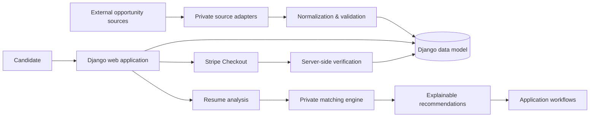

# JobHunt MU

### AI-Assisted Recruitment Platform | Python • Django • SQLite • Stripe • Data Processing

**Recruiter-facing engineering showcase for an independently built job-discovery and application platform.**

JobHunt MU brings multi-source job data into a normalized Django application and combines job discovery with candidate workflows, resume analysis, application preparation, payments and automated testing.

> **Portfolio boundary:** this public repository is a curated technical showcase, not the complete private JobHunt MU product. Source-specific collection adapters, exact recommendation weights/rules, private generation logic, credentials, live datasets and commercially useful implementation details are intentionally excluded.

## Resume-to-GitHub evidence

This repository is organized so the principal JobHunt MU claims on my resume can be inspected rather than taken on trust.

| Resume claim | Public evidence |
|---|---|
| Python/Django recruitment platform | `myproject/`, `myapp/`, models, views, templates and service modules |
| Multi-source job aggregation | Architecture/data-ingestion documentation and normalized source/freshness fields; private source adapters intentionally excluded |
| Four primary sources during development | MyJob.mu, Jobs.mu, Mauritius Jobs and Remotive documented as the verified development sources |
| 60+ live listings at a verified development milestone | Project documentation records the verified development milestone; live/full scraped datasets are intentionally not published |
| Stripe hosted Checkout | Payment workflow code and regression tests |
| Server-side payment verification | Stripe session/webhook architecture, payment models and tests |
| Resume/CV analysis | `myapp/services/cv_analyzer.py` and regression tests |
| Automated testing | `myapp/tests.py` plus GitHub Actions CI |
| Engineering/security practices | Docker, environment templates, CodeQL, CI and security/deployment documentation |

## What I built

The full project includes a Django web application that brings opportunities from multiple sources into a normalized data model and supports candidate-facing workflows around discovery and applications.

During development/testing, the aggregation pipeline worked with four primary automatic sources: **MyJob.mu, Jobs.mu, Mauritius Jobs and Remotive**, and produced **60+ live listings at a verified development milestone**. Optional connector experiments were explored separately. LinkedIn, Upwork and similar destinations are not represented as scraped sources.

The platform includes:

- searchable job and opportunity discovery;
- normalized company and opportunity records;
- source/freshness metadata and import-run tracking;
- PDF/DOCX resume extraction and structured analysis;
- explainable resume-to-job compatibility output;
- saved jobs and application tracking;
- application-document preparation workflows;
- Stripe-hosted Checkout with server-side verification;
- Django administration and relational persistence;
- automated regression tests and CI-oriented repository tooling.

## Technology

| Area | Technologies / concepts |
|---|---|
| Backend | Python, Django |
| Data | SQLite, relational modeling, normalization, ingestion workflows |
| Documents | PDF/DOCX extraction, structured resume analysis |
| Recommendations | Explainable matching architecture and evidence-based output |
| Payments | Stripe Checkout, server-side payment verification |
| Frontend | Django templates, Bootstrap, custom CSS |
| Engineering | Git, Docker, GitHub Actions, automated tests, Ruff, CodeQL |

## Architecture



The public repository retains enough structure to demonstrate Django application design, models, views, templates, document-processing concepts, configuration, testing and engineering documentation. Parts that would allow straightforward reproduction of the private product's highest-value behavior are deliberately abstracted.

## Testing evidence

The recruiter-visible regression suite covers representative public behavior including:

- rendering job listings;
- filtering listings by source;
- evidence-sensitive CV analysis;
- targeted resume/job skill-gap analysis;
- creation of pending Stripe payments;
- prevention of premium activation for unpaid Checkout sessions.

Additional tests for private source adapters, recommendation scoring and application-generation rules remain with the private implementation.

## Repository boundaries

### Included publicly

- Django project/application structure
- selected domain models and web workflow code
- resume-analysis engineering examples
- templates and UI structure
- payment-integration architecture
- safe environment-variable examples
- Docker/CI/testing configuration
- architecture, security and development documentation
- sanitized sample data where appropriate

### Intentionally private

- source-specific scraping/collection implementations
- production endpoints and adapter details that materially simplify cloning
- exact recommendation weights, aliases, heuristics and tuning
- private application-generation rules
- production credentials and deployment secrets
- user resumes, generated documents and other personal data
- live/full scraped datasets
- internal product research and commercially useful implementation details

## Resume intelligence

The project contains a privacy-conscious resume-analysis component for PDF/DOCX extraction and structured feedback. The current public code demonstrates parsing and deterministic analysis concepts. The project does **not** claim that a compatibility score predicts hiring outcomes.

The private recommendation pipeline uses normalized candidate/job evidence to produce interpretable compatibility information such as matched areas, gaps, confidence and score breakdowns. Exact scoring strategy and tuning are not part of this public showcase.

## Payments

JobHunt MU integrates Stripe-hosted Checkout. Payment state is verified server-side rather than trusting client-side success alone. Real Stripe keys and webhook secrets are never part of the repository.

## Data ingestion

The private project contains the complete multi-source connector layer. For IP protection, source-specific adapters are excluded from this public showcase. The architecture follows a connector → normalization → validation/deduplication → persistence → freshness-tracking pipeline.

This repository should therefore **not** be interpreted as a drop-in scraper package. It is evidence of the larger system's architecture and implementation work.

## Project structure

```text
jobhunt-mu/
├── myapp/                 # Django application
│   ├── services/          # Public service boundaries / selected safe implementation
│   ├── templates/         # Candidate and employer workflows
│   ├── static/            # UI assets
│   └── migrations/        # Data-model evolution
├── myproject/             # Django configuration
├── data/                  # Sanitized samples/documentation only
├── docs/                  # Architecture and engineering documentation
├── .github/               # CI and security automation
├── Dockerfile
├── docker-compose.yml
└── README.md
```

## Security and privacy

The project treats resumes and application documents as personal information. `.env` files, database files, uploaded resumes, generated private documents, production secrets and full live datasets should never be committed to a public repository.

The included `.env.example` contains placeholders only. Local development defaults to SQLite, while database and Stripe configuration are environment-driven.

## Project status

JobHunt MU is an **active independent project and portfolio system**, not a claim of a finished commercial recruitment service. Some public modules are intentionally incomplete relative to their private counterparts because high-value implementation details have been removed from the showcase.

## Recruiter review path

For a quick technical review:

1. `myapp/tests.py` — concrete regression evidence for job-board, CV-analysis and payment behavior.
2. `myapp/services/cv_analyzer.py` — resume/document analysis engineering.
3. `myapp/models.py` — relational/domain modeling.
4. `myapp/views.py` — Django workflow and payment integration patterns.
5. `ARCHITECTURE.md` — system boundaries and data flow.
6. `.github/workflows/` — CI and CodeQL automation.
7. `SECURITY.md` — privacy/security considerations.

## Author

**Ashwin Thakoor**  
AI, Data & Backend Development  
Mauritius — open to international relocation and remote opportunities

[GitHub Profile](https://github.com/AshwinThakoor) · [LinkedIn](https://www.linkedin.com/in/ashwin-thakoor-7aa2a3373)

## Usage and IP

The public repository is provided for portfolio review and technical discussion. Third-party job content, logos, trademarks and datasets remain subject to their respective owners' terms. The complete JobHunt MU implementation and excluded private components are not granted by publication of this showcase.
