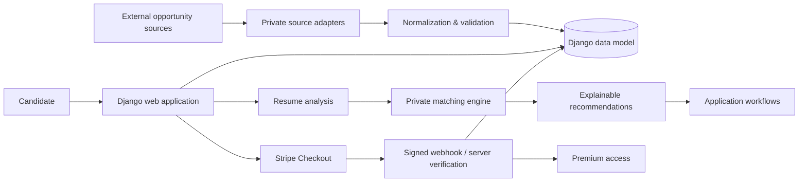

# JobHunt MU

### AI-Assisted Recruitment Platform | Python • Django • SQLite • Stripe • Data Processing

**Recruiter-facing engineering showcase for an independently built job-discovery and application platform.**

> **Demo / active development:** JobHunt MU is a working portfolio demo, not a finished commercial recruitment service. The screenshots and figures below document functionality verified in the private development build on **17 August 2026**. Matching, AI-facing workflows, UI polish and product depth are still being improved.

JobHunt MU brings multi-source opportunity data into a normalized Django application and combines discovery with candidate workflows, resume analysis, explainable matching, application preparation, payments and automated testing.

> **Public-repository boundary:** this repository is a curated technical showcase, not the complete private JobHunt MU product. Source-specific collection adapters, exact recommendation weights/rules, private generation logic, credentials, user data, live datasets and commercially useful implementation details are intentionally excluded.

## Verified demo snapshot

| Capability | Verified private demo evidence |
|---|---|
| Opportunity aggregation | **113 opportunities** displayed across **4 connected sources** |
| Connected sources | MyJob.mu, Jobs.mu, Mauritius Jobs, Remotive |
| Employers / clients | **69** displayed in the verified build |
| Discovery | Search/filtering across jobs, remote roles, graduate roles and freelance projects |
| Candidate workflows | Saved opportunities and application tracking |
| Resume intelligence | PDF/DOCX analysis, evidence-oriented scoring and skill-gap workflows |
| Recommendations | Explainable candidate/job matching with matched and missing skill evidence |
| Application Studio | Cover-letter / application-email workflows with premium document generation |
| Payments | Stripe-hosted Checkout tested successfully in **Sandbox** mode |
| Payment verification | Successful test payment, server-side verification and Premium activation |
| Webhooks | `payment_intent.succeeded` and `checkout.session.completed` delivered to Django with HTTP `200` during the verified test |
| Automated tests | **21/21 passing** in the private build; Django system check reported no issues |

The numbers above are a **point-in-time development snapshot**, not a promise of continuously live production inventory.

## Product walkthrough

The private demo currently demonstrates the following product flow:

1. Aggregate and normalize opportunities from multiple connected sources.
2. Browse a unified market feed with source attribution and filters.
3. Discover dedicated freelance/remote opportunities alongside conventional jobs.
4. Save opportunities and track applications.
5. Analyze a candidate CV and generate explainable compatibility evidence.
6. Prepare application material with truth/safety review prompts.
7. Upgrade through Stripe-hosted Checkout.
8. Verify payment server-side before granting Premium access.

### Screenshot gallery

The current private demo has verified screenshots for:

- **Explore Jobs** — 113 opportunities, 4 connected sources and 69 employers/clients in the verified build.
- **Source Directory** — imported opportunities from MyJob.mu, Jobs.mu, Mauritius Jobs and Remotive.
- **Freelance Discovery** — dedicated freelance-project filtering with source, location, compensation and skills.
- **Stripe Sandbox Checkout** — JobHunt MU Premium checkout using Stripe-hosted payment UI.
- **Premium Confirmation** — successful test payment verification and Premium activation.
- **Automated Testing** — 21 tests completed successfully.

> Screenshots containing personal candidate data, unfinished recommendation output or private implementation details are intentionally not published as final product evidence. The AI/matching experience remains under active refinement.

## What I built

The full private project includes:

- searchable multi-source job and opportunity discovery;
- normalized company/opportunity records;
- source and freshness metadata with import-run tracking;
- dedicated freelance and remote opportunity discovery;
- PDF/DOCX resume extraction and structured analysis;
- explainable resume-to-job compatibility output;
- saved opportunities and application tracking;
- application-document preparation workflows;
- premium feature access control;
- Stripe-hosted Checkout with server-side payment verification;
- signed Stripe webhook handling;
- Django administration and relational persistence;
- automated regression testing and CI-oriented repository tooling.

## Technology

| Area | Technologies / concepts |
|---|---|
| Backend | Python, Django |
| Data | SQLite, relational modeling, normalization, ingestion workflows |
| Documents | PDF/DOCX extraction, structured resume analysis, DOCX generation |
| Recommendations | Explainable matching architecture and evidence-based output |
| Payments | Stripe Checkout, signed webhooks, server-side payment verification |
| Frontend | Django templates, Bootstrap, custom CSS |
| Engineering | Git, Docker, GitHub Actions, automated tests, Ruff, CodeQL |

## Architecture



The public repository retains enough structure to demonstrate Django application design, models, views, templates, document-processing concepts, configuration, testing and engineering documentation. Parts that would allow straightforward reproduction of the private product's highest-value behavior are deliberately abstracted.

## Testing & reliability

The **private development build passed 21/21 automated tests** during the 17 August 2026 verification run. Coverage includes:

- public job-board rendering and filtering;
- category/source filtering and visibility rules;
- premium/basic recommendation access control;
- explainable and ranked recommendation behavior;
- saving recommendations;
- skill-alias normalization and matching confidence;
- CV scoring, skill-gap analysis and user isolation;
- Application Studio basic/premium permissions;
- premium document generation/editing/DOCX download;
- scraper description parsing;
- Stripe Checkout creation;
- prevention of Premium activation from an unverified/legacy success path;
- successful paid-checkout Premium activation;
- prevention of Premium activation for unpaid Checkout sessions.

The public repository contains a sanitized recruiter-visible test suite and CI configuration. Some private tests and implementation details remain excluded with the private product.

## Payment verification

Stripe is implemented as a server-verified workflow rather than trusting a browser redirect.

During the verified Sandbox run:

```text
Stripe Checkout created successfully
        ↓
Test payment succeeded
        ↓
payment_intent.succeeded → Django webhook → HTTP 200
checkout.session.completed → Django webhook → HTTP 200
        ↓
Payment verified
        ↓
Premium access activated
```

No real card or production credentials are required for this portfolio demonstration. Stripe secrets, webhook signing secrets and `.env` files are never committed.

## Resume intelligence & matching

The project contains privacy-conscious PDF/DOCX resume extraction and structured feedback. The matching pipeline produces interpretable evidence such as matched skills, missing/unclear skills, confidence and score breakdowns.

The system does **not** claim that a compatibility score predicts hiring outcomes. The recommendation experience is currently being improved, particularly around role relevance, ranking quality and final AI-facing presentation. This is deliberately described as an active demo rather than a finished recommendation product.

## Application Studio

The private build includes application-document workflows for preparing material such as cover letters and application emails. The workflow includes a truth/safety review that reminds the candidate to verify qualifications, tools, metrics, names/contact information and tone before using generated material.

Premium document-generation/editing/DOCX behavior is covered by the private automated test suite. Generation rules and commercially useful implementation details are intentionally not exposed publicly.

## Data ingestion

The private project contains the complete multi-source connector layer. During the verified demo snapshot, the UI displayed:

- MyJob.mu — 40 imported opportunities;
- Jobs.mu — 10 imported opportunities;
- Mauritius Jobs — 40 imported opportunities;
- Remotive — 23 imported opportunities.

That totals **113 opportunities across four connected sources** in the verified local build. Optional provider integrations that require API credentials are not counted as connected sources.

For IP protection, source-specific adapters are excluded from this public showcase. The architecture follows a connector → normalization → validation/deduplication → persistence → freshness-tracking pipeline.

## Repository boundaries

### Included publicly

- Django project/application structure
- selected domain models and web workflow code
- resume-analysis engineering examples
- templates and UI structure
- payment-integration architecture
- safe environment-variable examples
- Docker/CI/testing configuration
- architecture, security and development documentation
- sanitized sample data where appropriate

### Intentionally private

- source-specific scraping/collection implementations
- production endpoints and adapter details that materially simplify cloning
- exact recommendation weights, aliases, heuristics and tuning
- private application-generation rules
- production credentials and deployment secrets
- user resumes, generated documents and other personal data
- live/full scraped datasets
- internal product research and commercially useful implementation details

## Project structure

```text
jobhunt-mu/
├── myapp/                 # Django application
│   ├── services/          # Public service boundaries / selected safe implementation
│   ├── templates/         # Candidate and employer workflows
│   ├── static/            # UI assets
│   └── migrations/        # Data-model evolution
├── myproject/             # Django configuration
├── data/                  # Sanitized samples/documentation only
├── docs/                  # Architecture and engineering documentation
├── .github/               # CI and security automation
├── Dockerfile
├── docker-compose.yml
└── README.md
```

## Security and privacy

The project treats resumes and application documents as personal information. `.env` files, database files, uploaded resumes, generated private documents, production secrets and full live datasets should never be committed to a public repository.

The included `.env.example` contains placeholders only. Local development defaults to SQLite, while database and Stripe configuration are environment-driven.

## Project status & roadmap

**Current status: working portfolio demo / active development.**

The purpose of this repository is to demonstrate that the underlying product workflows work and to make the engineering decisions inspectable without publishing the full private product.

Current improvement areas include:

- stronger role-relevance ranking and recommendation quality;
- refinement of AI-facing CV/matching experiences;
- richer dashboard/application workflow polish;
- broader approved data-provider integrations;
- continued UI/UX refinement and production hardening.

The project will continue to evolve; the current demo should be read as a verified engineering milestone, not the final JobHunt MU product.

## Recruiter review path

For a quick technical review:

1. `myapp/tests.py` — regression evidence for job-board, CV-analysis and payment behavior.
2. `myapp/services/cv_analyzer.py` — resume/document analysis engineering.
3. `myapp/models.py` — relational/domain modeling.
4. `myapp/views.py` — Django workflow and payment integration patterns.
5. `ARCHITECTURE.md` — system boundaries and data flow.
6. `.github/workflows/` — CI and CodeQL automation.
7. `SECURITY.md` — privacy/security considerations.

## Author

**Ashwin Thakoor**  
AI, Data & Backend Development  
Mauritius — open to international relocation and remote opportunities

## Usage and IP

The public repository is provided for portfolio review and technical discussion. Third-party job content, logos, trademarks and datasets remain subject to their respective owners' terms. The complete JobHunt MU implementation and excluded private components are not granted by publication of this showcase.
