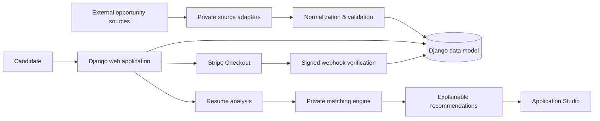

# JobHunt MU

**Recruiter-facing engineering showcase for a Django-based job discovery and application platform.**

JobHunt MU is an independent project exploring multi-source opportunity aggregation, data normalization, candidate workflows, resume analysis, explainable job matching, application preparation and payment integration.

> **Portfolio boundary:** this repository is a curated technical showcase, not the complete private JobHunt MU product. Source-specific collection adapters, exact recommendation weights/rules, private application-generation logic, production credentials, live datasets and other commercially useful implementation details are intentionally excluded.

## What I built

The full project includes a Django web application that brings opportunities from multiple sources into a normalized data model and supports candidate-facing workflows around discovery and applications.

During development/testing, the aggregation pipeline worked with four primary automatic sources: **MyJob.mu, Jobs.mu, Mauritius Jobs and Remotive**, and produced **60+ live listings at a verified development milestone**. Optional connector experiments were also explored separately. LinkedIn, Upwork and similar destinations are not represented as scraped sources.

The platform also includes:

- searchable job and opportunity discovery;
- normalized company and opportunity records;
- source/freshness metadata and import-run tracking;
- PDF/DOCX resume extraction and structured analysis;
- explainable resume-to-job compatibility output;
- saved jobs and application tracking;
- application-document preparation workflows;
- Stripe-hosted Checkout with server-side signed webhook verification;
- Django administration and relational persistence;
- automated tests and CI-oriented repository tooling.

## Technology

| Area | Technologies / concepts |
|---|---|
| Backend | Python, Django |
| Data | SQLite, relational modeling, normalization, ingestion workflows |
| Documents | PDF/DOCX extraction, structured resume analysis |
| Recommendations | Explainable matching architecture and evidence-based output |
| Payments | Stripe Checkout, webhook verification |
| Frontend | Django templates, Bootstrap, custom CSS |
| Engineering | Git, Docker, GitHub Actions, automated tests, Ruff |

## Architecture



The public repository retains enough structure to demonstrate Django application design, models, views, templates, document-processing concepts, configuration, testing and engineering documentation. The parts that would allow straightforward reproduction of the private product's highest-value behavior are deliberately abstracted.

## Repository boundaries

### Included publicly

- Django project/application structure
- selected domain models and web workflow code
- resume-analysis engineering examples
- templates and UI structure
- payment-integration architecture
- safe environment-variable examples
- Docker/CI/testing configuration
- architecture, security and development documentation
- sanitized sample data where appropriate

### Intentionally private

- source-specific scraping/collection implementations
- production endpoints and source-adapter details that materially simplify cloning
- exact recommendation weights, aliases, heuristics and tuning
- private application-generation rules
- production credentials and deployment secrets
- user resumes, generated documents and other personal data
- live/full scraped datasets
- internal product research and commercially useful implementation details

This separation is intentional: the repository demonstrates the engineering work without publishing the complete product.

## Resume intelligence

The project contains a privacy-conscious resume-analysis component for PDF/DOCX extraction and structured feedback. The current public code demonstrates parsing and analysis concepts. The complete product does not claim that a compatibility score predicts hiring outcomes.

The private recommendation pipeline uses normalized candidate/job evidence to produce interpretable compatibility information such as matched areas, gaps, confidence and a score breakdown. Exact scoring strategy and tuning are not part of this public showcase.

## Application Studio

The full project can prepare editable application materials from candidate-provided evidence and a selected opportunity. The implementation is designed to avoid inventing unsupported experience. Product-specific generation and ranking logic remains private; the public repository exposes only the architectural boundary.

## Payments

JobHunt MU integrates Stripe-hosted Checkout. Payment completion is verified server-side through signed webhook handling rather than trusting client-side success alone. Real Stripe keys and webhook secrets are never part of the repository.

## Data ingestion

The private project contains the complete multi-source connector layer. For IP protection, source-specific adapters are excluded from this public showcase. The architecture follows a connector → normalization → validation/deduplication → persistence → freshness-tracking pipeline.

This repository should therefore **not** be interpreted as a drop-in scraper package. It is evidence of the larger system's architecture and implementation work.

## Local project structure

```text
jobhunt-mu/
├── myapp/                 # Django application
│   ├── services/          # Public service boundaries / selected safe implementation
│   ├── templates/         # Candidate and employer workflows
│   ├── static/            # UI assets
│   └── migrations/        # Data-model evolution
├── myproject/             # Django configuration
├── data/                  # Sanitized samples/documentation only
├── docs/                  # Architecture and engineering documentation
├── .github/               # CI and repository automation
├── Dockerfile
├── docker-compose.yml
└── README.md
```

## Security and privacy

The project treats resumes and application documents as personal information. `.env` files, database files, uploaded resumes, generated private documents, production secrets and full live datasets should never be committed to a public repository.

The included `.env.example` contains placeholders only. Local development defaults to SQLite, while database and Stripe configuration are environment-driven.

## Project status

JobHunt MU is an **active independent project and portfolio system**, not a claim of a finished commercial recruitment service. Some public modules are intentionally non-runnable because their complete private counterparts have been removed from the showcase.

That trade-off is deliberate: recruiters can inspect genuine architecture and engineering work while the product's most reusable implementation remains protected.

## Recruiter review path

For a quick technical review, I recommend looking at:

1. `ARCHITECTURE.md` — system boundaries and data flow.
2. `myapp/models.py` — relational/domain modeling.
3. `myapp/services/cv_analyzer.py` — document/resume analysis engineering.
4. `myapp/views.py` — Django workflow and Stripe integration patterns.
5. `myapp/tests.py` and `.github/workflows/` — testing and engineering practices.
6. `SECURITY.md` — privacy/security considerations.

## Author

**Ashwin Thakoor**  
AI, Data & Backend Development  
Mauritius — open to international relocation and remote opportunities

GitHub: https://github.com/AshwinThakoor

## Usage and IP

The public repository is provided for portfolio review and technical discussion. Third-party job content, logos, trademarks and datasets remain subject to their respective owners' terms. The complete JobHunt MU implementation and excluded private components are not granted by publication of this showcase.
